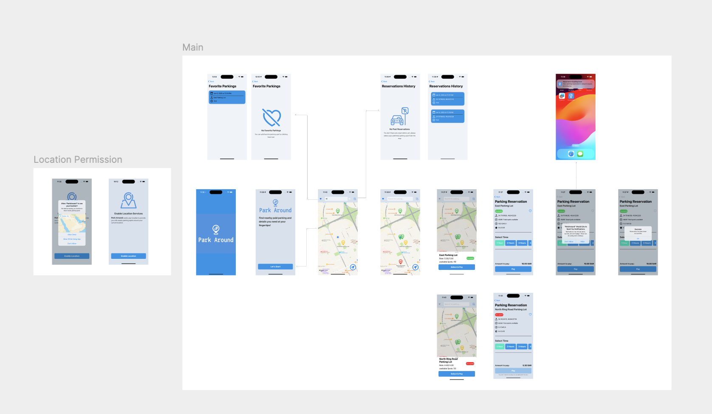

# Park Around


"Park Around" is an iOS application designed to simplify finding and reserving nearby parking spots. compatiable with iOS 17 and later. It saves user's reservations history and favorite locatinos data in SwiftData so it can be accessed offline. Also, it supports light/dark mode

## Build and Run Instructions


1. make sure  you have Xcode version 15.0 or above installed in you computer
2. Clone the repository
```
  git clone https://github.com/DalalBinhamoud/ParkAround.git
  cd ParkAround
```
3. Open and run the Xcode Project

### Testing Details


**Mocked API Response**: The app uses a JSON file to mock parking location API response.

**Real Network Response**: The project includes code for real network requests but it's disabled for testing with the JSON file.

**Mocked Location**: A simulated user current location is shown to display nearby parking spots that included in the JSON file.

## Usage

In order to use the app, you must grant location access permission.


## Future Enhancement

🚀 **General Improvements**

- **Support Swift 6:** Prepare the project to be compatible with Swift 6.

- **Increase Test Coverage:** add more unit and UI tests.

- **SwiftLint Integration:** Add SwiftLint to enforce consistent coding standards.

📍 **Features for a Better User Experience**

- **Real nearby Parking Spots:** Display real response of nearby parking spots based on user location within a  radius (e.g., 5 km).

- **Multiple Active Reservations:** Support multiple active parking sessions for users with more than one car, linking reservations to specific vehicle identifiers. Also, enhance tracking of sessions in when app is in background

- **Favorite Parking Spots:** Enable users to save and quickly access favorite parking locations.

💳 **Payment**

- Implement a real secure payment API to handle parking fees.

🔔 **Enhanced Alerts and Navigation**

 - **Alert Handling:** Refactor views to use `AlertWrapper` enabling convenient alert presentations throughout the app. Also, support multiple alert styles (e.g., Toast notification).

- **Robust Navigation:** Build a reliable and well-structured navigation stack to ensure a seamless and intuitive user flow.

🔥 **Visualization Features**

- **Heatmap Support:** Add a heatmap to visualize parking occupancy levels.
## Screenshots



